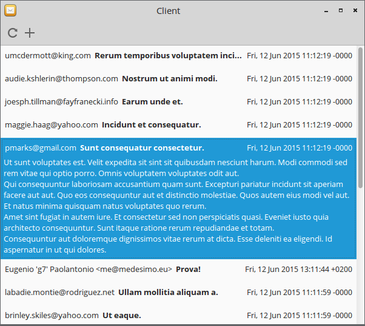

Building the client
===================



Vala uses Gio (part of GLib) to interface with DBus.

The source code of the client is in `src/client`. It's possible to compile it using `make`:

	cd src/client
	make client

Creating the interface
----------------------

Vala isn't interpreted like Python, so we can't determine at run-time which are the methods of the DBus service.  
It's thus necessary having an interface that will be used to abstract the remote DBus object.

```Java
namespace Thesis {

	[DBus (name = "eu.medesimo.thesis")]
	public interface ThesisInterface : Object {
		
		/**
		 * DBus interface to the thesis service.
		*/
		
		public signal void NewEmail(int id);
		
		public abstract void AddAccount(
			string name,
			string address,
			string server,
			string username,
			string password,
			int port,
			string servertype,
			bool ssl
		) throws IOError;
		public abstract HashTable<string, int> GetServerTypes() throws IOError;
		public abstract string[] GetEmailDetails(int id) throws IOError;
		public abstract void CheckAll() throws IOError;
		public abstract void GetAccounts() throws IOError;
	
	}
	
	[DBus (name = "eu.medesimo.thesis.email")]
	public interface EmailInterface : Object {
		
		/**
		 * DBus interface to the Email object.
		*/
		
		public abstract void Check() throws IOError;
		public abstract bool GetStatus() throws IOError;
		
	}

}
```

Nothing to explain here. The DBus interface is specified just before the actual vala interface declaration.

Connecting to the service
-------------------------

Here comes the fun part. Making a connection to the service is a really simple task.

(The following excerpt is from the main `Client` class, see `src/client/client.vala` for more details)

```Java
	public class Client : Object {
		
		/**
		 * Main class for the client.
		*/
		
		public Cancellable cancellable;
		
		public ThesisInterface iface;
				
		public Client() {
			/**
			 * Constructor.
			*/
			
			this.cancellable = new Cancellable();
			
			/* Connect to DBus */
			this.iface = Bus.get_proxy_sync(
				BusType.SESSION,
				"eu.medesimo.thesis",
				"/eu/medesimo/thesis",
				DBusProxyFlags.NONE,
				this.cancellable
			);
		
		}
		
	}
```

First of all, the ThesisInterface interface that has been created before is used to instantiate the `iface` variable, that
is our gateway to the remote DBus object created by the service.

In the `Client()` constructor, the connection is obtained via `Bus.get_proxy_sync()`, that requires the main informations of the object
it should connect to (Bus, Name and Object path).

### Cancellables

A `Cancellable` is a special object that is used throughout GIO (part of GLib) to allow for cancellation of synchronous and asynchronous operations.

By calling the `cancel()` method of a Cancellable, the objects linked to it (in our case the DBus connection) gets cancelled ASAP.

Using the service through the connection
----------------------------------------

After having estabilished the connection, the ThesisInterface object will behave like a normal class, so it's possible to subscribe to its signals:

```Java
public Client() {
	...
	
	this.iface.NewEmail.connect(this.on_new_email);
}

public void on_new_email(int email_id) {
	print("Hey! A new email has arrived! ID: %d\n".printf(email_id));
}
```

...and call its methods:

```Java
public void perform_check() {
	this.iface.CheckAll();
}

public void print_supported_servers() {
	HashTable<string, int> supported = this.iface.GetServerTypes();
	
	supported.foreach(
		(key, value) => {
			print("%s (%d)\n".printf(key, value));
		}
	);
}
```

Wrap up
-------

And that's all! The rest that the Client does is just presenting the informations coming from the service in a nice graphical way.
