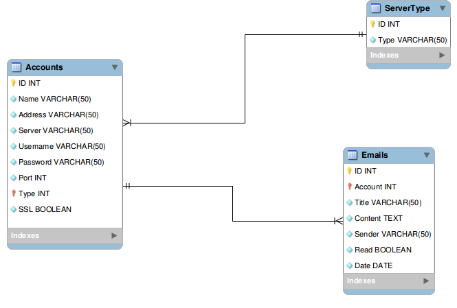

The Service database
====================

Analysis
--------

The underlying database is pretty simplistic and it is composed by three
entities:

### Account

```SQL
CREATE TABLE Accounts (
	ID INTEGER PRIMARY KEY NOT NULL,
	Name VARCHAR(50) NOT NULL,
	Address VARCHAR(50) NOT NULL,
	Server VARCHAR(50) NOT NULL,
	Username VARCHAR(50) NOT NULL,
	Password VARCHAR(200) NOT NULL,
	Port int NOT NULL,
	Type int references ServerType(ID) NOT NULL,
	SSL BOOLEAN NOT NULL
);
```

The **Account** entity stores the details of every e-mail account,
including Username, Password, Server address and Port.  

The Password is, for convenience reasons, in plaintext. Storing an hash
would mean having a password prompt every time the service wants to check for
new e-mails and that would be pretty annoying (and beyond the scope of this project).  

The E-Mail address and the Account name are also stored here.  

The Account entity references in its `Type` attribute the **ServerType** entity, see below.

### ServerType

```SQL
CREATE TABLE ServerType (
	ID INTEGER PRIMARY KEY NOT NULL,
	Type VARCHAR(50) NOT NULL
);

/* Sample data */
INSERT INTO ServerType (Type) VALUES ("IMAP");
INSERT INTO ServerType (Type) VALUES ("POP3");
INSERT INTO ServerType (Type) VALUES ("MOCK");
```

The **ServerType** entity stores the various server types that the service supports.  

During the database setup, this entity is pre-loaded with the following types:

* IMAP
* POP3 (not supported by the service, inserted only as an example)
* MOCK

The `MOCK` type is a special ServerType that permits the demonstration of this project
even when the system is offline (and thus can't download new email using `IMAP` or `POP3`).  
E-Mails are generated on-the-fly with dummy content.

<!-- Next page -->
<br /><br /><br /><br />
### Email

```SQL
CREATE TABLE Emails (
	ID INTEGER PRIMARY KEY NOT NULL,
	Account int references Accounts(ID) NOT NULL,
	Title VARCHAR(50) NOT NULL,
	Content TEXT NOT NULL,
	Sender VARCHAR(50) NOT NULL,
	Read BOOLEAN NOT NULL,
	Date DATE NOT NULL
);
```

The **Email** entity, instead, hosts the content of every fetched e-mail.  
It references the **Account** entity in its `Account` attribute in order to store the Account
e-mails are fetched from.

E/R Model
---------



Logic Model
-----------

### Accounts

<table>
    <tr>
        <th>Attribute</th>
        <th>Type</th>
        <th>Key</th>
        <th>Description</th>
        <th>References</th>
        <th>Required</th>
    </tr>
    <tr>
		<td>ID</td> <td>INTEGER</td> <td>PRIMARY</td> <td /> <td /> <td>YES</td>
	</tr>
	<tr>
		<td>Name</td> <td>VARCHAR(50)</td> <td /> <td /> <td /> <td>YES</td>
	</tr>
	<tr>
		<td>Address</td> <td>VARCHAR(50)</td> <td /> <td /> <td /> <td>YES</td>
	</tr>
	<tr>
		<td>Server</td> <td>VARCHAR(50)</td> <td /> <td /> <td /> <td>YES</td>
	</tr>
	<tr>
		<td>Username</td> <td>VARCHAR(50)</td> <td /> <td /> <td /> <td>YES</td>
	</tr>
	<tr>
		<td>Password</td> <td>VARCHAR(200)</td> <td /> <td /> <td /> <td>YES</td>
	</tr>
	<tr>
		<td>Port</td> <td>INTEGER</td> <td /> <td /> <td /> <td>YES</td>
	</tr>
	<tr>
		<td>Type</td> <td>INTEGER</td> <td>FOREIGN</td> <td>Server Type</td> <td>ServerType(ID)</td> <td>YES</td>
	</tr>
	<tr>
		<td>SSL</td> <td>BOOLEAN</td> <td /> <td>Secure Sockets Layer</td> <td /> <td>YES</td>
	</tr>
</table>

### ServerType

<table>
    <tr>
        <th>Attribute</th>
        <th>Type</th>
        <th>Key</th>
        <th>Description</th>
        <th>References</th>
        <th>Required</th>
    </tr>
    <tr>
		<td>ID</td> <td>INTEGER</td> <td>PRIMARY</td> <td /> <td /> <td>YES</td>
	</tr>
	<tr>
		<td>Type</td> <td>VARCHAR(50)</td> <td /> <td>Description</td> <td /> <td>YES</td>
	</tr>
</table>

### Emails

<table>
    <tr>
        <th>Attribute</th>
        <th>Type</th>
        <th>Key</th>
        <th>Description</th>
        <th>References</th>
        <th>Required</th>
    </tr>
    <tr>
		<td>ID</td> <td>INTEGER</td> <td>PRIMARY</td> <td /> <td /> <td>YES</td>
	</tr>
	<tr>
		<td>Account</td> <td>INTEGER</td> <td>FOREIGN</td> <td>Account</td> <td>Accounts(ID)</td> <td>YES</td>
	</tr>
	<tr>
		<td>Title</td> <td>VARCHAR(50)</td> <td /> <td /> <td /> <td>YES</td>
	</tr>
	<tr>
		<td>Content</td> <td>TEXT</td> <td /> <td /> <td /> <td>YES</td>
	</tr>
	<tr>
		<td>Sender</td> <td>VARCHAR(50)</td> <td /> <td /> <td /> <td>YES</td>
	</tr>
	<tr>
		<td>Read</td> <td>BOOLEAN</td> <td /> <td /> <td /> <td>YES</td>
	</tr>
	<tr>
		<td>Date</td> <td>DATE</td> <td /> <td /> <td /> <td>YES</td>
	</tr>
</table>
