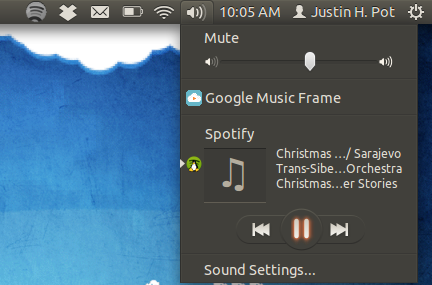
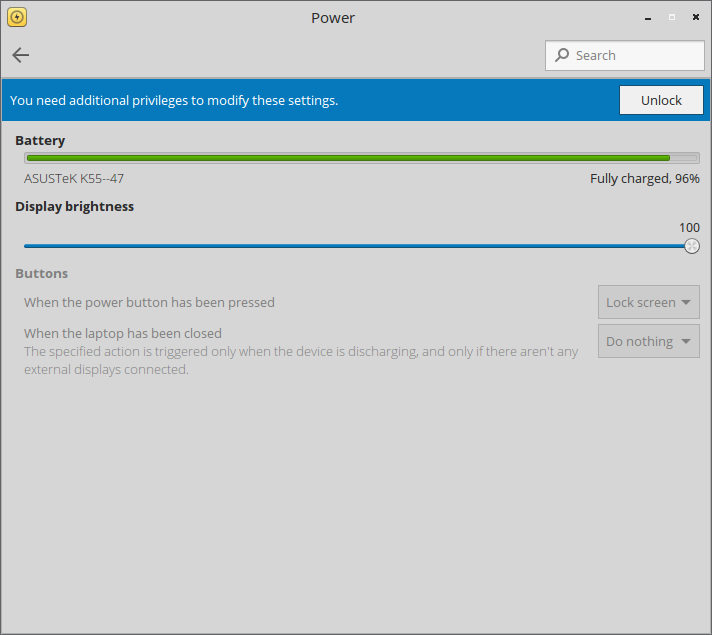

Introduction
============

D-Bus is an inter-process communication (IPC) specification that allows communication
between multiple processes.

It also permits to launch applications only when needed and to reliably implement a "single instance" mechanism.

**NOTE:** Throughout the entire document I'll refer to the specification with **D-Bus** and to
the actual implementation as *DBus* or *dbus*.


Why?
----

D-Bus provides an easy-to-use, reliable, heavily-tested and fast solution to the problem
of communication between two applications on the same system.

An IPC mechanism is a very important matter in the design of a modern Operating System and
permits to make every concerned part of the system aware when something happens (for example, an
USB pendrive has been just plugged in, the network connection has stopped working or a SMS has arrived).

DBus is the IPC of choice in every modern GNU/Linux distribution (including Debian, Ubuntu, Semplice, Fedora, Arch
on desktop machines and SailfishOS, MeeGo, Maemo and Tizen on mobile phones and tablets).
A Windows port also exists.

D-Bus is designed and intended for same-machine uses.

The usage of D-Bus has grown so much that nowadays it's also used for system administration.

Services and applications
-------------------------

During the whole document, I'll refer to both **services** and **applications**.

Many of the D-Bus beneficiaries are services, processes that run in background and that aren't
designed to require user input. Most of those use the **system bus** (see [The busses](#the-busses) for more details).

Applications can use D-Bus too, though: for example, a music player. Most of the applications
use the **session bus**.

The busses
----------

With D-Bus, there are two different busses:

* The **system bus**, that is started at boot and provides communication between system
  services and (but not only) the end-user
* The **session bus** that is started at every user login and provides an in-session IPC
  mechanism.
 
Services using the system bus include *NetworkManager* (network management), *Bluez* (bluetooth),
*PackageKit* (general package management) and *UPower* (energy management).

For example, when the laptop goes out-of-range of the current Wi-Fi and thus the connection is dropped,
*NetworkManager* sends a notification to every concerned application (for example Firefox or Thunderbird),
so that they could automatically set the "Offline mode".

The piece that permits this communication to happen is D-Bus.

Applications using the session bus are, for example, Spotify: D-Bus is the mechanism that permits
to change or pause the current song from another application (for example the Music Menu in Ubuntu):

<!-- Next page -->
<br /><br /><br /><br /><br />


Activatable services
--------------------

D-Bus supports activatable services: services that are started only when needed, and thus not
require staying in the background during the entire lifecycle of the session/the system itself.

For example, the service that permits to change the localization settings of the Operating System doesn't
need to stay in background. By making the said service activatable, it will get automatically started by D-Bus
when the user wants to change the language, transparently.

Authentication
--------------

Using [Polkit](http://www.freedesktop.org/wiki/Software/polkit/), a framework to grant access to privileged
operations for unprivileged applications, it's possible to implement an authentication mechanism.



As an example, the Power section of the Semplice Linux (http://semplice-linux.org) control center (pictured above)
uses Polkit to modify some of the system-wide settings (the power buttons behaviours).

How does that work in practice? Everything goes through DBus. The control center itself is running as
an unprivileged user and thus can't change the settings.

When the user clicks the "Unlock" button, Polkit is invoked (through DBus) and requires a password for a given
privilege (in this case the modification of the power buttons behaviours).

When the user actually changes the setting from the user interface, the unprivileged application (the
control center) invokes the system service via DBus, that in turn will check with Polkit to see if the
privilege has been granted and, if yes, will change the setting.

So Polkit works as a "middle-man" between the user (the control center, unprivileged) and the system (the DBus service, privileged).

And the best thing? No privilege escalation happens, as the changes are done by the background system service: the
user interface remains unprivileged.

All of this won't be possible without an Inter-Process Communication mechanism like DBus.

Terminology
-----------

During the course of the document, I'll use the following terms (from the D-Bus Specification, http://dbus.freedesktop.org/doc/dbus-specification.html):

* Bus name: this is the name that is associated with the service or application. For example, the Bus Name of
  *usersd* (used to manage users and groups in Semplice Linux) is `org.semplicelinux.usersd`.

* Objects: those are the objects that the service exports through the Bus. For example, the object of the `root` user
  is `/org/semplicelinux/usersd/user/0`.
 
* Interfaces: interfaces permit to "separate" different-purpose methods inside objects. For example, the main object
  of usersd, `/org/semplicelinux/usersd` has an interface to manage users, `org.semplicelinux.usersd.user` and one
  to manage groups, `org.semplicelinux.usersd.group`.

Monitor
-------

It's fun to watch the communication that D-Bus services and applications do, in the background.

With the `dbus-monitor` command it's possible to watch services talk to each other.  
The following excerpt comes from my mobile phone, running [SailfishOS](http://sailfishos.org):

```
[nemo@Jolla ~]$ dbus-monitor --system
signal sender=:1.141 -> dest=(null destination) serial=11187 path=/org/freedesktop/UPower/devices/battery_battery; interface=org.freedesktop.UPower.Device; member=Changed
signal sender=:1.141 -> dest=(null destination) serial=11188 path=/org/freedesktop/UPower; interface=org.freedesktop.UPower; member=DeviceChanged
   string "/org/freedesktop/UPower/devices/battery_battery"
signal sender=:1.141 -> dest=(null destination) serial=11189 path=/org/freedesktop/UPower/devices/battery_battery; interface=org.freedesktop.UPower.Device; member=Changed
signal sender=:1.141 -> dest=(null destination) serial=11190 path=/org/freedesktop/UPower; interface=org.freedesktop.UPower; member=DeviceChanged
   string "/org/freedesktop/UPower/devices/battery_battery"
signal sender=:1.1 -> dest=(null destination) serial=8066 path=/com/nokia/mce/signal; interface=com.nokia.mce.signal; member=tklock_mode_ind
   string "locked"
signal sender=:1.1 -> dest=(null destination) serial=8070 path=/com/nokia/mce/signal; interface=com.nokia.mce.signal; member=display_status_ind
   string "off"
signal sender=:1.141 -> dest=(null destination) serial=11191 path=/org/freedesktop/UPower/devices/battery_battery; interface=org.freedesktop.UPower.Device; member=Changed
signal sender=:1.141 -> dest=(null destination) serial=11192 path=/org/freedesktop/UPower; interface=org.freedesktop.UPower; member=DeviceChanged
   string "/org/freedesktop/UPower/devices/battery_battery"
signal sender=:1.1 -> dest=(null destination) serial=8080 path=/com/nokia/mce/signal; interface=com.nokia.mce.signal; member=display_status_ind
   string "on"
signal sender=:1.1 -> dest=(null destination) serial=8084 path=/com/nokia/mce/signal; interface=com.nokia.mce.signal; member=lpm_ui_mode_ind
   string "enabled"
signal sender=:1.1 -> dest=(null destination) serial=8085 path=/com/nokia/mce/signal; interface=com.nokia.mce.signal; member=display_status_ind
   string "off"
^C
[nemo@Jolla ~]$ 
```

Here, it's possible to see when I locked or unlocked the phone (`tklock_mode_ind` signal) and also when the display has been powered on or off (`display_status_ind`).

This is nice because it let me create a simple Screen usage monitor (https://github.com/g7/jolla-settings-screenmonitor) for my phone,
that got display status updates directly via D-Bus by the operating system itself
(instead of polling for it every time, trashing the battery life of the device).


