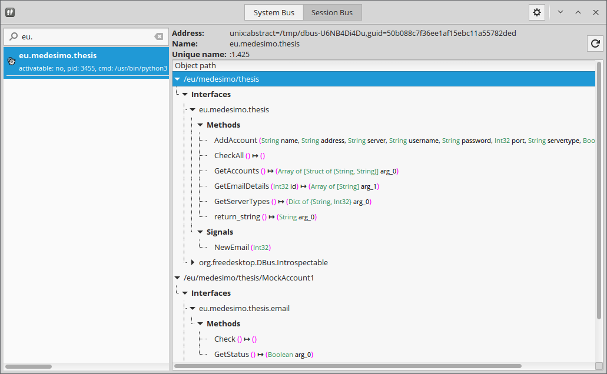

Building the service
====================

So now that is clear how the database interface will work, it's time to actually explain
the workings of the entire service.

Python has two widely used DBus bindings, [`dbus-python`](http://dbus.freedesktop.org/doc/dbus-python/doc/tutorial.html)
and [`Gio.DBusProxy`](http://lazka.github.io/pgi-docs/#Gio-2.0/classes/DBusProxy.html#Gio.DBusProxy).  
The latter (currently) only supports accessing a remote object (i.e. it's useful only to build a client), so I used `dbus-python`.

Getting started
---------------

First of all, it's necessary to define **which** bus to use, **what** should be exported to it, and **how**.

As this application is going to be used in end-user environments, I chose the *Session Bus*.

The service is named *eu.medesimo.thesis* (DBus services usually use a reverse-domain notation), and the
main object is exported to */eu/medesimo/thesis*.

Every e-mail account has its own object, exported to */eu/medesimo/thesis/name*, where `name` is the name of the account.

The main object use the *`eu.medesimo.thesis`* interface, while the e-mail objects use *`eu.medesimo.thesis.email`*.



The BaseObject object
---------------------

Given the fact that there are going to be two different types of objects, I have created a
generic class that will handle the registration to the bus:

<!-- Next page -->
<br /><br /><br /><br /><br />
```python
# This file contains the base object of the service.

import dbus
import dbus.service

from gi.repository import GLib, Polkit

class BaseObject(dbus.service.Object):
	"""
	A base object!
	"""
	
	# The DBus object path
	path = "/eu/medesimo/thesis"
	
	# The DBus interface name
	interface_name = "eu.medesimo.thesis"

	def __init__(self, bus_name):
		"""
		Initializes the object.
		"""
		
		super().__init__(bus_name, self.path)

```
(`src/core/objects.py`)

This is pretty simple but it's a great starting point when something more advanced is needed,
such as properties implementation.  
I have done something similar in the past for another project of mine, see https://github.com/semplice/usersd/blob/master/usersd/objects.py.

The MainService object
----------------------

The `MainService` object is the one exported to */eu/medesimo/thesis* and it's the parent of every other object in the service:

The following is a stripped-down version of the class, see `src/service.py` for the full code.

```python

import dbus

import core.objects

from dbus.mainloop.glib import DBusGMainLoop

from gi.repository import GLib

class MainService(core.objects.BaseObject):
	
	"""
	This is the DBus service.
	"""
	
	path = "/eu/medesimo/thesis"
		
	def __init__(self):
		"""
		Initializes the object.
		"""
		
		self.bus_name = dbus.service.BusName(
			"eu.medesimo.thesis",
			bus=dbus.SessionBus()
		)
		
		super().__init__(self.bus_name)
	
	@dbus.service.signal(
		"eu.medesimo.thesis",
		signature="i"
	)
	def NewEmail(self, id):
		"""
		Signal emitted whenever a new email has arrived.
		"""
		
		pass
	
	@dbus.service.method(
		"eu.medesimo.thesis",
		out_signature="a{si}"
	)
	def GetServerTypes(self):
		"""
		Returns a dictionary of server types, where the key is the Type Description
		and the value is the numeric ID.
		"""
		
		return {"MOCK":3, "IMAP":2, "POP3":1}

	@dbus.service.method(
		"eu.medesimo.thesis",
		in_signature="sssssisb",
		out_signature="b"
	)
	def AddAccount(self, name, address, server, username, password, port, servertype, ssl):
		"""
		Adds an account.
		
		Returns True if everything succeeded, False otherwise.
		"""
		
		return False
	
	@dbus.service.method(
		"eu.medesimo.thesis",
		in_signature="i",
		out_signature="as" # Returning an array is _not_ the best decision to make, but it's simpler to handle in the other side
	)
	def GetEmailDetails(self, id):
		"""
		Given an e-mail id, returns its details.
		"""
		
		return []
	
	@dbus.service.method(
		"eu.medesimo.thesis",
		out_signature="a(ss)"
	)
	def GetAccounts(self):
		"""
		Returns a list of accounts, by name.
		"""
		
		return [("MockAccount1", "ser@ver"), ("medesimo", "me@medesimo.eu")]
	
	@dbus.service.method(
		"eu.medesimo.thesis"
	)
	def CheckAll(self):
		"""
		Checks an email on all accounts.
		"""
				
		pass
	
	@dbus.service.method(
		"eu.medesimo.thesis",
		out_signature="s"
	)
	def return_string(self):
		"""
		Returns a string.
		"""
		
		return "Ciao!"

if __name__ == "__main__":
	
	DBusGMainLoop(set_as_default=True)
	clss = MainService()
	
	GLib.MainLoop().run()
```

For clarity, every method above returns a dummy value just to demonstrate how the binding work.

### Connecting to the Bus

The connection to the Bus is handled in the class initializer (`__init__`):

```python
class MainService(core.objects.BaseObject):
	
	"""
	This is the DBus service.
	"""
	
	path = "/eu/medesimo/thesis"

	def __init__(self):
		"""
		Initializes the object.
		"""
		
		self.bus_name = dbus.service.BusName(
			"eu.medesimo.thesis",
			bus=dbus.SessionBus()
		)
		
		super().__init__(self.bus_name)
```

This is pretty simple. The application registers itself to the SessionBus (see the `bus=` keyword) using the `eu.medesimo.thesis` bus name.

Then the `BaseObject`'s initializer is called, which will then register the entire class as an object, in `/eu/medesimo/thesis`.

### The event loop

In order to listen to events and trigger signals, it's necessary to create an event loop. This is handled at the end of the file, using `GLib.Mainloop`:

<!-- Next page -->
<br /<br /><br /><br /><br />
```python
if __name__ == "__main__":
	
	DBusGMainLoop(set_as_default=True)
	clss = MainService()
	
	GLib.MainLoop().run()
```

Without the main loop, the application would - understandably - exit.

The `__name__` internal variable is set by the Python interpreter as `__main__` when the script is running "as an application".  
This avoids the creation of the MainLoop when the service is imported from another python script.  


### Methods

Method introspection is handled automatically by `dbus-python`, so creating a method is easy:

```python
	@dbus.service.method(
		"eu.medesimo.thesis",
		out_signature="a{si}"
	)
	def GetServerTypes(self):
		"""
		Returns a dictionary of server types, where the key is the Type Description
		and the value is the numeric ID.
		"""
		
		return {"MOCK":3, "POP3":2, "IMAP":1}
```

The `@dbus.service.method` decorator is the one that does the magic. It uses Python's dynamic nature to create the introspection at run-time.
Methods which don't use this decorator will of course not be exported through DBus.

#### `in_signature` and `out_signature`

Of course there is the need to specify the type of the input and output arguments.
They are specified with the `in_signature=` and `out_signature=` keywords, respectively.

They are handled internally as [GVariants](https://developer.gnome.org/glib/stable/glib-GVariant.html#GVariant).  
The following table contains some of the most used symbols for variants. A full list is available at https://developer.gnome.org/glib/stable/gvariant-format-strings.html.

<table>
    <tr>
        <th>Symbol</th>
        <th>Meaning</th>
    </tr>
    <tr>
		<td>b</td> <td>Boolean</td>
	</tr>
	<tr>
		<td>y</td> <td>Char</td>
	</tr>
	<tr>
		<td>i</td> <td>int32</td>
	</tr>
	<tr>
		<td>x</td> <td>int64</td>
	</tr>
	<tr>
		<td>d</td> <td>Double</td>
	</tr>
	<tr>
		<td>s</td> <td>String</td>
	</tr>
	<tr>
		<td>v</td> <td>A GVariant itself</td>
	</tr>
	<tr>
		<td>a#</td> <td>Array of type #</td>
	</tr>
	<tr>
		<td>as</td> <td>Array of Strings</td>
	</tr>
	<tr>
		<td>ai</td> <td>Array of int32s</td>
	</tr>
	<tr>
		<td>()</td> <td>Tuple</td>
	</tr>
	<tr>
		<td>(si)</td> <td>Tuple composed by a String and an int32</td>
	</tr>
	<tr>
		<td>a{#?}</td> <td>Dictionary with Key of type # and Value of type ?</td>
	</tr>
	<tr>
		<td>a{si}</td> <td>Dictionary with Key of type String and Value of type int32</td>
	</tr>
</table>

Thus, a method that accepts an integer and returns a string is similar to this:

```python
	@dbus.service.method(
		"eu.medesimo.thesis",
		in_signature="i",
		out_signature="s"
	)
	def ToString(self, integer):
		"""
		Returns the supplied integer, as a string!
		And the result is sent over the bus! Whohoo!
		"""
		
		return str(integer)
```

### Signals

Signals are handled in a similar manner:

```python
	@dbus.service.signal(
		"eu.medesimo.thesis",
		signature="i"
	)
	def NewEmail(self, id):
		"""
		Signal emitted whenever a new email has arrived.
		"""
		
		pass
```

Understandably, signals don't have an `out_signature`, so here the keyword to use to specify arguments' types is `signature`.

The EmailBox object
-------------------

This is the object that gets exported to `/eu/medesimo/thesis/<EmailAccount>` and offers a method to check for new e-mails.

You can refer to the full implementation at `src/core/email_object.py`.
